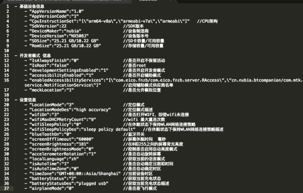

# 项目详细介绍

## 目录

- Intimate
- ImageWatcher
- RecycleBitmap
- DoggerMonitor
- SettingsMonitor
- DoggerService

兴趣探索型项目

- CakeRouter 
- CakeDao
- OnceClick
- EmbedView
- CakeRun
- ScrollBanner

重构

## Intimate

Intimate 提供了友好的 API 让 java 反射的使用更加简单平滑。其最核心的价值在于 Intimate 将在编译期对 Apk 内部代码（您编写的 App 代码或引入的第三方库）的调用进行反射优化，完全免除反射的效率问题，使得反射调用就像普通调用一样快捷且无任何代价。

开源地址：[https://github.com/eleme/Intimate](https://github.com/eleme/Intimate)

## ImageWatcher

ImageWatcher 皆在帮助您重新掌控处于失控的资源文件，主要功能为排除项目中将会在运行期占用大额内存空间的图片。可动态配置内存上限值、白名单、何种编译类型启动检查（debug or release）。

**静态检查**：编译期遍历项目中(含第三方库)中所有图片资源，计算其在不同设备下将会占用内存大小，超出临界值时抛出异常，编译失败。

抛错示例如下：

**动态检查**：利用AOP的方式，Hook App运行期间每一次的图片创建操作，计算每一次创建的Bitmap的大小，超出临界值时将抛出异常，用户可选择上传至日志等方式监控异常。

**未开源**

## RecycleBitmap

RecycleBitmap 皆在帮助App优化运行时图片内存消耗，是一款更高效的图片内存复用框架。

其特性如下：

- 新展示的图片复用已不在展示的图片内存空间，避免额外的内存分配与GC。
- 封装了适合各种场景的图片内存复用策略，使得各类场景下接入简单高效。
- RecycleBitmap 追求更小的内存占用与更加平滑的内存曲线。

优化效果如下：

**未开源**

## DoggerMonitor

DoggerMonitor 是一款Android端性能监控工具。一键化接入，无需任何埋点，接入项目后，可以实现FPS监控、内存监控、CPU监控、App启动时间监控、Activity启动时间监控、Activity页面流转记录（负责以上功能开发）。其他功能：线程数监控、方法耗时监控、内存泄漏监控、流量消耗监控、卡顿监控。

功能展示如下：

**未开源**

## SettingsMonitor

SettingsMonitor 是一款 Android 设备设置信息监控工具，其目的是获取设备的一系列信息，帮助开发者最大程度还原事故现场。

其产生的背景是 设备的各项信息收集分散在各种系统当中，且还存在大量的信息缺失，“信息”到用时方恨少。急缺一个统一而全面的信息收集系统。

SettingsMonitor 除信息收集以外，还有设置信息变更的监控功能，实现设备设置信息变更轨迹的获取，最大程度帮助排障。

SettingsMonitor 已实现的监控数据如下：

除信息收集以外，对已收集的信息做统计分析以后，将得到一些意外的惊喜：

- 在全量的用户中，统计root用户的占比与数量。这个数据在对外挂的防御中，我们考虑是否彻底禁止root用户抢单，是很重要的依据。
- 在全量的用户中，统计设备是否自动确定时间的用户占比为x%,App时间与服务端时间不统一极易导致展示性Bug，而我们知道依然有x%的用户还处于未自动同步网络时间的状态，我们应该做一些有效的同步措施或用户引导。
- 定位一直是我们的重中之重，统计数据后我们得知将定位精度开启到了最高的用户并不是特别多，这一块我们还要加强引导力度。

**未开源**

## DoggerService

DoggerService是一个桌面级产品化系统，解析Dogger日志文件，以更人性化方式展示日志内容，皆在帮助开发者更高效的排障以及从日志中挖掘更多的价值。

提供日志数据图表展示、源日志快速定位与检索、不同类型日志的统计与分析三大模块功能。

纯 JS 项目，部署于CDN， 无需考虑并发问题。No Server， 最大化利用客户端算力。

目前已支持17+个日志类型的图表展示以及统计分析。

目前正开始逐步推广至公司其他部门，当前项目已具备开源基础。

是笔者的首次移动端向web前端技术跨界的尝试。

1.首页图，可选择拖动日志文件或从网络获取，实现日志解析。

2.源日志查看，支持 [快速 / 详细] 的日志类型筛选与时间筛选。支持文案 [定位 / 过滤] 搜索。

其目的在于帮助开发者从海量的日志信息中更快速的定位与查找问题。

3.Chart展示，用户行为 / 设备状态信息 的图表展示，针对不同类型日志设计设了一套完整的展示策略方案。支持时间轴展开，以更细化的查看各项信息。帮助开发者以时间为维度，更加直观的横向观察各种用户行为，从中排查问题。

3.统计模块,针对不同日志类型做不同的数据统计分析。从日志中挖掘更多的价值。
现支持的统计类型有：电量、内存、网络状态、网络请求、Activity生命周期、Fragment生命周期、点击事件、轮询事件、骑手轨迹、定位点、定位上传。

图示举例：电量统计，电量 最大 / 最小 值，电量值的半数分布，电量值的曲线展示

例如：网络状态统计，网络跳动次数，强网到弱网的跳动次数，弱网到无网的跳动次数，各类型网络状态时间占比

除从移动开发到前端开发的技术栈转变以外，在开发以外，还学到了、体验到了更多。
做自己的产品经理、做自己的项目经理、做自己的视觉交互设计师。

## CakeRouter

基于编译时注解的页面路由库，无需提前配置或配置少量参数，即可通过URL启动Activity,支持携带参数。

基于编译时注解，免除反射效率影响。

地址： [https://github.com/lizhaoxuan/CakeRouter](https://github.com/lizhaoxuan/CakeRouter)

## CakeDao

基于编译时注解的Android ORM数据库框架。

基于编译时注解，无反射性能损耗，效率同直接使用SQLite一样。

地址 [https://github.com/lizhaoxuan/CakeDao](https://github.com/lizhaoxuan/CakeDao)

## OnceClick 

基于编译时注解，在一定时间内，按钮点击事件只能执行一次。未到指定时间，不执行点击事件。避免低端机连续点击下的重复bug。

地址 [https://github.com/lizhaoxuan/OnceClick](https://github.com/lizhaoxuan/OnceClick)

## EmbedView

EmbedView 嵌入式View框架.解决重复控件的添加问题。

地址 [https://github.com/lizhaoxuan/EmbedView](https://github.com/lizhaoxuan/EmbedView)

## ScrollBanner

一个用法类似ListView 且性能高于ViewPager的滚动banner

地址 [https://github.com/lizhaoxuan/ScrollBanner](https://github.com/lizhaoxuan/ScrollBanner)

## CakeRun

Android Crash Hook 框架

地址 [https://github.com/lizhaoxuan/CakeRun](https://github.com/lizhaoxuan/CakeRun)

##